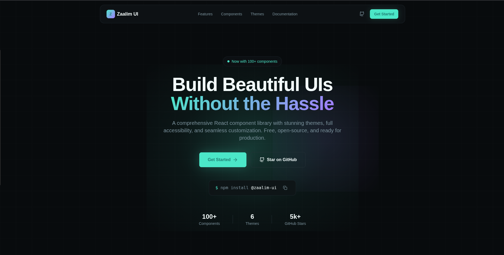

# Zaalim UI



A modern, themeable React component library with built-in multi-theme support. Built with TypeScript and TailwindCSS for seamless developer experience.

## 🌟 Features

### 🎨 Multi-Theme Support

- **Light & Dark Themes**: Built-in themes with zero configuration
- **Custom Themes**: Create and apply your own color schemes
- **Live Preview**: Theme switching in documentation playground

### 📦 TypeScript First

- Full type safety for all components
- IntelliSense support in your IDE
- Comprehensive type exports

### 🎯 Optimized Performance

- Tree-shakable exports
- Minimal bundle size
- No unnecessary dependencies

## 🚀 Installation

```bash
npm install zaalim-ui
```

## ⚡ Quick Start

### Basic Usage

```bash
import { Button, ThemeProvider } from 'zaalim-ui';

function App() {
  return (
    <ThemeProvider>
      <Button variant="primary">Hello World</Button>
    </ThemeProvider>
  );
}
```

### Theme Switching

```bash
import { ThemeProvider, Button, useTheme } from 'zaalim-ui';

function ThemeToggle() {
  const { theme, setTheme } = useTheme();

  return (
    <Button
      variant="outline"
      onClick={() => setTheme(theme === 'light' ? 'dark' : 'light')}
    >
      Switch to {theme === 'light' ? 'Dark' : 'Light'} Mode
    </Button>
  );
}
```

## 📁 Project Structure

### Monorepo Architecture

```bash
zaalim-ui/
├── packages/
│   ├── ui/                    # Core component library
│   ├── docs/                  # Next.js documentation site
│   └── themes/                # Theme system
├── apps/
│   └── playground/            # Component development environment
├── turbo.json                 # Turborepo configuration
└── package.json
```

## Core Components

### Available Components

- Button
- Input
- Card
- Modal
- Alert
- ThemeProvider
- Tables
- Sliders
- Avatars
- Inputs
- Forms
- Badges
- Toast
- Tabs
- Menu
- Paginations
- List
- Accordion
- Chip
- Timeline
- Tree
- Sidebar
- Dozens of other components and are adding new components after every few days

## 🎨 Theming System

### Using Built-in Themes

```bash
import { ThemeProvider, Button } from 'zaalim-ui';

function App() {
  return (
    <ThemeProvider defaultTheme="dark">
      <Button>Dark Mode Button</Button>
    </ThemeProvider>
  );
}
```

## 🛠️ Development

### Local Setup

```bash
# Clone the repository
git clone https://github.com/yourusername/zaalim-ui.git

# Install dependencies
npm install

# Start development environment
npm run dev
```

### Available Scripts

```bash
# Start documentation site
npm run dev:docs

# Build all packages
npm run build

# Run tests
npm run test

# Run type checking
npm run type-check

# Run linter
npm run lint
```

## 📖 Documentation

#### Visit our documentation site for:

- Interactive component playground
- Live theme preview
- API reference with examples
- Customization guides
- Migration assistance

## 📱 Browser Support

- Chrome 90+
- Firefox 88+
- Safari 14+
- Edge 90+

## 🤝 Contributing

We welcome contributions! Please read our Contributing Guidelines before submitting.

### Development Workflow

- Fork the repository
- Create a feature branch: git checkout -b feature/amazing-feature
- Make your changes and test thoroughly
- Submit a pull request

## Code Standards

- Follow TypeScript best practices
- Write tests for new components
- Update documentation
- Ensure accessibility compliance

## ❓ Common Issues

### Theme Not Applying

Ensure ThemeProvider wraps your application root.

### TypeScript Errors

Run npm run type-check to verify type definitions.

### Build Issues

Clear node_modules and reinstall: npm clean-install

## 📄 License

MIT © Zaalim UI
